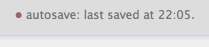

# Transcriber

Transcriber is a webpage-as-text-processor that helps you to transcribe audio into text. The key benefit to using this tool is the integration of audio playback control, so you don't have to juggle two applications (audio player and word processor) at the same time while transcribing. This can be quite a timesaver and makes transcribing a little less elaborate.

After loading the webpage, it works as follows:

1. Drag and drop an audio file onto this browser window.
2. Start typing in the text area below.
3. Use the keypad numbers to control playback without having to move your hands away from the keyboard.
4. Insert a timestamp at cursor position by pressing 8 on the numeric keypad.
5. Text is automatically saved between sessions. Copy the text elsewhere for permanent storage.

## Saving data

The webpage saves the contents of the textfield automatically while you're typing. Just above the textfield a little dot indicates whether changes have been made since the last save action.

Data is only saved within the browser's storage. If you would clean up the browser or use a private window (which trashes all data on closing), you would loose the content. So while the saving mechanism works well to keep data save across browsing sessions and prevents against data loss due to a crash, it's not save for permanent storage.

No mechanism is implemented for exporting and saving data. Just select all content and copy it to your favourite text processor.

## Playback control

Use the numbers of the numpad to control playback.

* 0 + 5: Play/pause.
* 4 + 7: Rewind 5 or 10 seconds.
* 6 + 9: Forward 5 or 10 seconds.
* 1 + 2 + 3: Adjust playback speed (-, reset, +).
* 8: Insert timestamp at cursor position.

Without a numpad available, such as on most laptops, this poses problems as no ordinary keys could be repurposed. This tool probably isn't too useful in combination with a numpad-less keyboard.

## Accepted audio files

Most audio files should be accepted as the default browser playback functions are used, although file support differences exist between browsers.

* MP3
* MP4 audio (no support in Firefox)
* Ogg/vorbis (no support in Safari)
* Wave (WAV)
* WebM

## Browser compatibility

The webpage has been tested to work with the following browsers:

* Firefox 31+
* Google Chrome 37+
* Safari 7+ (has some layout issues)

## License

No specific license has been chosen, but feel free to use the code as you see fit. It would be nice to learn of interesting uses.
